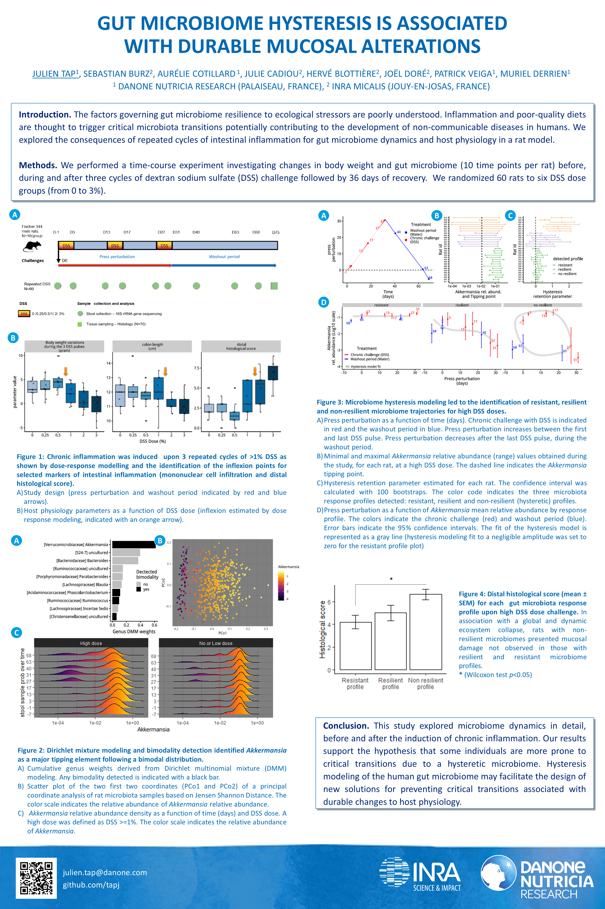

We presented a study entitled "Gut microbiome hysteresis is associated with durable mucosal alterations" during the Keystone Symposia poster session helded at Killarney : "[Microbiome: Therapeutic Implications](http://www.keystonesymposia.org/20T1)"

*(right click to enlarge image)*{{more}} <!--more-->

### Abstract

**Introduction.** The factors governing gut microbiome resilience upon ecological stressors are poorly understood. Inflammation and poor-quality diets are thought to trigger microbiota critical transition that may contribute to the development of non-communicable diseases in humans. Here, we explored the consequences of repeated cycles of intestinal inflammation on gut microbiome dynamics in a rat model.

**Methods.** We designed a time course experiment to capture the variations in body weight and gut microbiome (10 time points per rat) prior, during and after 3 cycles of Dextran Sodium Sulfate (DSS) challenge followed by 36 days of recovery phase.  60 rats were randomized to six groups of DSS doses (from 0 to 3%). Colonic histology and fecal lipocalin were assessed at sacrifice and analyzed with dose-response modeling. In addition to microbiome diversity analysis, Dirichlet-multinomial mixture and hysteresis models were used.

**Results.** We observed higher levels of selected markers of intestinal inflammation (mononuclear cell infiltration, distal histological score and fecal lipocalin) after the final recovery period for the rats exposed to the highest doses of DSS (1% to 3%), suggesting a critical transition associated with durable mucosal alterations. An analysis of the gut microbiome dynamics identified *Akkermansia* as a major tipping element following a bimodal distribution. This finding, together with microbiome hysteresis modeling, resulted in the identification of resistant, resilient and non-resilient microbiome trajectories for high DSS doses. Rats with non-resilient microbiomes displayed mucosal damages relative to those with resilient microbiome profiles. 

**Conclusion.** This study provides a thorough exploration of microbiome dynamics prior and after an induced chronic inflammation. Our results support the hypothesis that some individuals are more prone to critical transition due to their hysteretic microbiome. In the future, hysteresis modelling of human gut microbiome may help design new solutions to prevent critical transitions associated with host physiology durable alterations.

Authors : Julien Tap, Sebastian Burz, Aurélie Cotillard, Julie Cadiou, Hervé Blottière, Joël Doré, Patrick Veiga, Muriel Derrien

You may found the source code on [github](https://github.com/tapj/richness)
