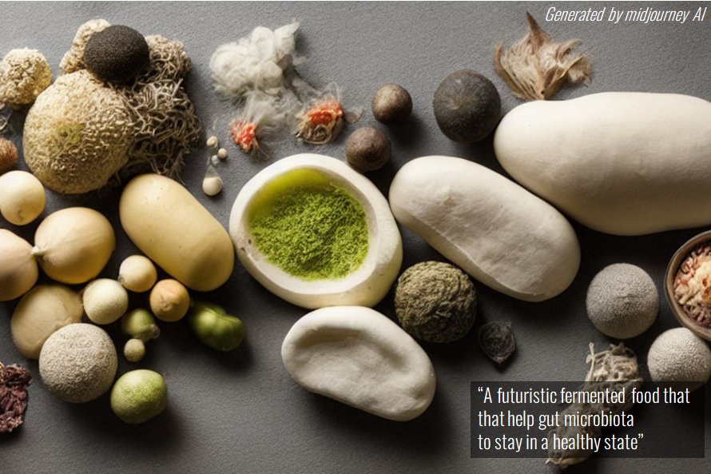

What if we ask an AI to generate a realistic picture about futuristic fermented foods that keep microbiota to stay in an healthy state?

This is what I tried with [midjourney](https://www.midjourney.com/home/). 
Midjourney is a proprietary artificial intelligence program that creates images from textual descriptions.

here is the result :

it looks scary but still inspiring!

