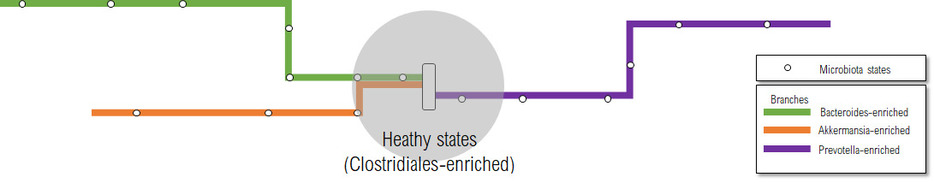

A recent study published in Nature Communications[^1] by researchers from Danone Research (Gif-sur-Yvette) and the University of San Diego in California examined 35,000 fecal samples from different populations and regions, making it one of the broadest studies of the gut microbiome.

The results revealed different communities within the gut microbiome, called "ecological states", which are interconnected in larger groups called "microbiome branches". These branches represent a continuum of microbiome configurations, dynamically linking local ecological states.

The researchers replicated this finding on several datasets, such as curatedMetagenomicData (CMD) and the American Gut Project (AGP), comprising diverse populations and age groups. Significant variations were observed in the different states of the microbiome in individuals belonging to the Bacteroides-enriched branch, indicating that the Faecalibacterium/Bacteroides ratio could serve as an indicator of microbiome instability.

The analysis also revealed the considerable impact of host factors such as age, body mass index, stool frequency, antibiotic use and region of birth on the gut microbiome. Dietary factors, including plant diversity, snack frequency, vegetable consumption and sweet foods, are associated with ecological states of the gut microbiome.

These findings highlight the importance of structuring microbiome data both locally and globally to better understand transitions between states and associations with health, diet and lifestyle. Thinking of the microbiome as branch-connected ecological states paves the way more than ever for personalized nutritional and therapeutic interventions.

[^1]: Tap et al. [Global branches and local states of the human gut microbiome define associations with environmental and intrinsic factors](https://doi.org/10.1038/s41467-023-38558-7). 2023. Nature communications

